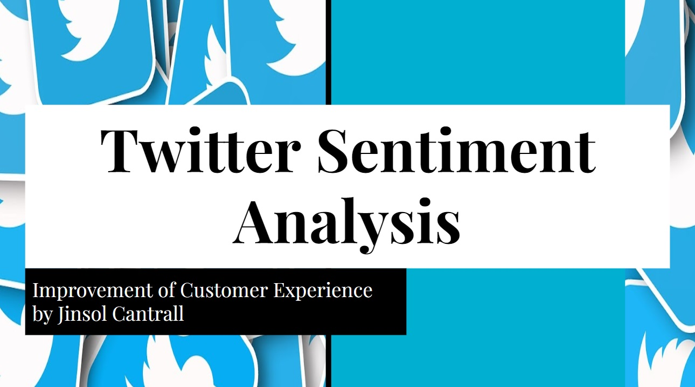
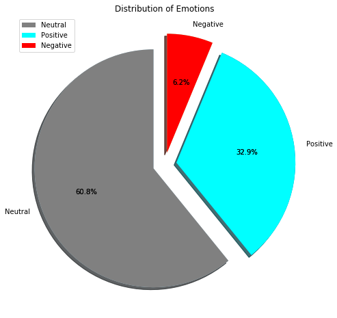
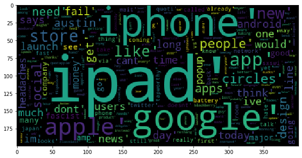
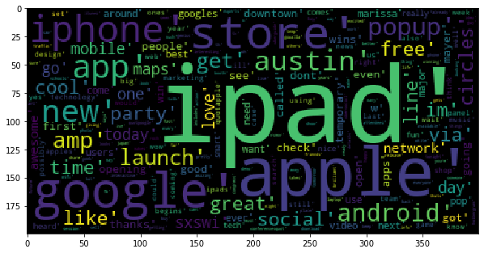
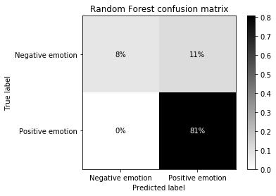

#  Twitter Sentiment Analysis

**By**: Jinsol Cantrall
****
## ●Overview●
NLP(Natural Language Processing) is used to analyze interactions between computers and human language. With sentiment analysis model, companies do not have spend extra money to secret shopper or read all the reviews manually.

## ●Business Problem●
▶ A business company is trying to bring next-level customer experiences. In order to do so, company is seeking to recieve the feedback directly from non-paid customers. If the company hires secret shopper or promotions for reviews, the company do not think it is a genuine feedbacks. Therefore, the company is asking to create a model by using tweets from Twitter to see their positive and negative feedbacks.

① What is Sentiment Analysis? 
② Can tweets reflect customers positive/negative emotions? 
③ Should the business focus on positive/negative feedbacks? 
④ Can tweets show popularity of certain brands/products? 
⑤ Can the model predict the positive/negative feedbacks? 

## ●Data Understanding●

▶ **Tweets from Twitter**
customers were asked to tweet and ratie positive, negative, or neutral emotions
 
 
**Negative WordCloud**

 
**Positive WordCloud**

## ●Results●

 
After comparing all three model, Model 2 - Random Forst is the best model. 
 
 
**Model 2 -Random Forst Confusion Matrix**
 
▶ Predicted that 8% words are Negative emotion and it is true.(True Positive)
 
▶ Predicted that 81% words are Positive emotion and it is true. (True Negative)
 
▶ Predicted that 11% words are Nagative emotion but it is false.(False Negative)
 
▶ Predicted that 0% words are Positive emotion but it is false. (False Positive)
 
 
It also has the highest accuracy: 89%.
 
 
① What is Sentiment Analysis? 
It is an analysis that will benefit any company that provides products and services. 
 
② Can tweets reflect customers positive/negative emotions? 
Yes. After cleaning the tweets, I was able to create a wordcloud that shows both positive and negative emotions. 
 
③ Should the business focus on positive/negative feedbacks 
I would suggest to focus more on positive feedbacks since majority(only compairing to posivite/negative) of the tweets were positive. 
 
④ Can tweets show popularity of certain brands/products? 
Yes. By using word cloud, I can even visualize the popularities. 
 
⑤ Can the model predict the positive/negative feedbacks? 
Yes. My model is able to predict as mentioned above (random forest confusion materix explanations)

## ●Next Steps●
- Since the data was limited, pulling API from Twitter would increase the accuracy and will be able to create better model and judgemnt of the positivity or negativity.
 
- Creating real-time model is going to aid business decisions for effectively since there are 350,000 tweets are appearing every minute. 
 
- Increase the stopwords to reduce unnecessary noise of the dataset. Although I have removed fairly enough words but adding more to the list would definitely incrase the accuracy.
 
- Investigate Neutral Emotions

